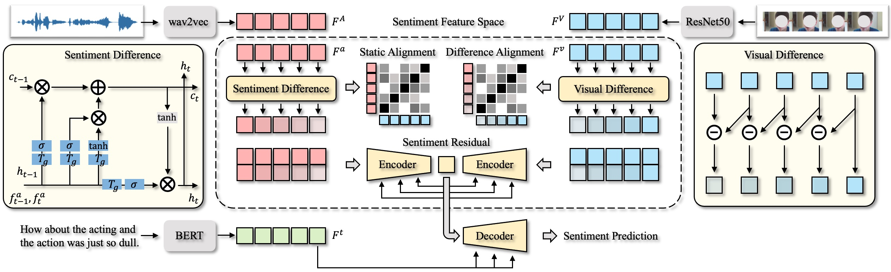

# Multimodal Emotion Recognition with DUAL
This repository presents **DUAL (Dynamic Unified Alignment for Low-text dependency)**, a multimodal emotion recognition model that leverages **audio**, **visual**, and **textual** modalities. Unlike traditional models that rely heavily on text, DUAL prioritizes **audio-visual signals** and introduces text only at the **decoding stage** for semantic refinement, enabling robust performance even under **noisy or missing text** conditions.

## Table of Contents

- [Introduction](#introduction)  
- [Project Goals](#project-goals)  
- [Dataset Information](#dataset-information)  
- [Code Information](#code-information)  
- [Setup & Dependencies](#setup-&-dependencies)  
- [Usage Instructions](#usage-instructions)  
- [Methodology](#methodology)  
- [Citation](#citation)  
- [License](#license)  
- [Contribution Guidelines](#contribution-guidelines)  

---

## Introduction

**DUAL** is designed to improve **multimodal emotion recognition** by reducing reliance on textual input and exploiting the rich **emotional cues** inherent in audio and visual modalities.
Key innovations include:
- **Sentiment Differential Module (SDM)**: captures temporal differences in audio signals.
- **Visual Differential Module (VDM)**: models dynamic visual emotion cues.
- **Sentiment Residual (SR) mechanism**: enhances cross-modal complementarity.
- **Cross-Attention Decoder**: integrates text only for semantic refinement.
This approach ensures higher robustness and adaptability in real-world applications where text may be incomplete, noisy, or unavailable.

---

## Project Goals

- Develop a **low-text dependency** emotion recognition model.
- Prioritize **audio-visual modalities** for emotion understanding.
- Introduce **differential & residual mechanisms** for dynamic and cross-modal modeling.
- Provide a **modular, reusable, and efficient codebase** for research.

---

## Dataset Information
Please download the following datasets into a folder, e.g. /gpfsdswork/dataset/DUAL and unzip:

IEMOCAP dataset (audio, visual, and text dialogues, ~12 GB) from the [[IEMOCAP official website](https://sail.usc.edu/iemocap/?utm_source=chatgpt.com)].

MELD dataset (multimodal multi-party dialogues with emotion annotations, ~2 GB) from the [[MELD official website](https://affective-meld.github.io/?utm_source=chatgpt.com)].

(Optional) Other multimodal benchmarks (aligned audio-visual-text datasets) depending on your experiment setup.
The dataset folder at /gpfsdswork/dataset/DUAL should have the following structure:

```bash
└── /gpfsdswork/dataset/DUAL
    ├── IEMOCAP
    │   ├── Audio
    │   ├── Video
    │   └── Transcriptions
    ├── MELD
    │   ├── train
    │   ├── dev
    │   └── test
    └── OtherDatasets
        └── ...
```
---

## Code Information

The repository contains the following core modules:
- **Encoders**: Audio encoder and Visual encoder for modality-specific feature extraction
- **Alignment**: Nonlinear fusion into a unified emotional space
- **Differential Modules**: SDM (audio) and VDM (visual) for temporal dynamics
- **Residual Mechanism**: Sentiment Residual (SR) for cross-modal enhancement
- **Decoder**: Cross-attention with text integration at the final stage
- **Loss Functions**: Combination of classification, static alignment, and dynamic alignment losses

---

## Setup & Dependencies
**Environment Setup**

```bash
# Clone the repository
git clone https://github.com/yourusername/dual-emotion-recognition
cd dual-emotion-recognition

# Create and activate environment
conda create -y --name dual python=3.9
conda activate dual

# Install dependencies
pip install -r requirements.txt
```
**Requirements**
- Python 3.9
- PyTorch >= 1.10
- Transformers (Hugging Face)
- OpenCV
- librosa
- NumPy, SciPy, scikit-learn
- tqdm

---

## Usage Instructions
**Train the model**

```bash
python train.py
```
**Evaluate the model**

```bash
python evaluate.py
```
**Inference on new model**

```bash
python inference.py --input path_to_input_data
```
---

## Usage Instructions

The DUAL framework follows these steps:
1. **Feature Extraction**
- Extract audio embeddings (e.g., using CNNs or wav2vec-based models).
- Extract visual embeddings (e.g., with ResNet or Vision Transformer).
- Text embeddings are encoded only at the final decoding stage.
2. **Nonlinear Alignment**
- Audio and visual features are projected into a unified emotional latent space.
3. **Differential Modeling**
- SDM and VDM capture temporal differences and emotional dynamics.
4. **Residual Enhancement**
- Sentiment Residual (SR) introduces cross-modal residual projections for complementarity.
5. **Cross-Attention Decoding**
- Text is introduced only at the decoding phase, refining predictions with minimal reliance.

---

## License

This project is licensed under the MIT License. See the LICENSE file for details.

---


## Contribution Guidelines

Contributions are welcome! Please follow these steps:
1. Fork the repository
2. Create a feature branch (git checkout -b feature-name)
3. Commit your changes (git commit -m 'Add feature')
4. Push to your branch (git push origin feature-name)
5. Submit a Pull Request

---
